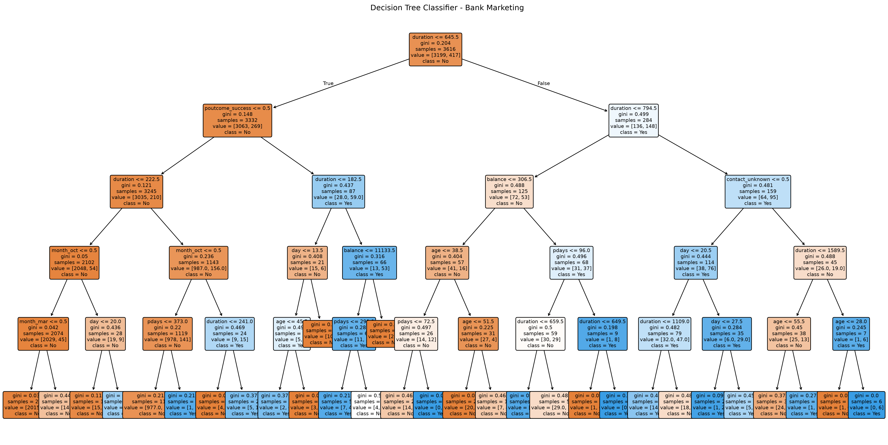
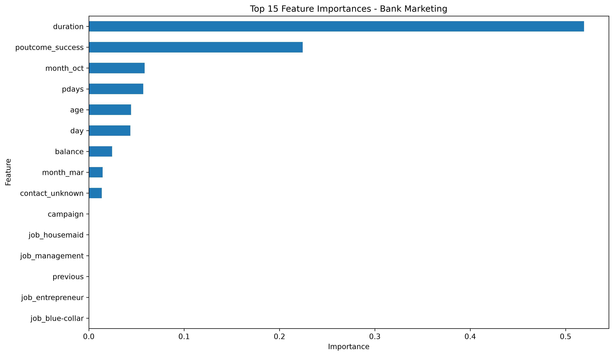
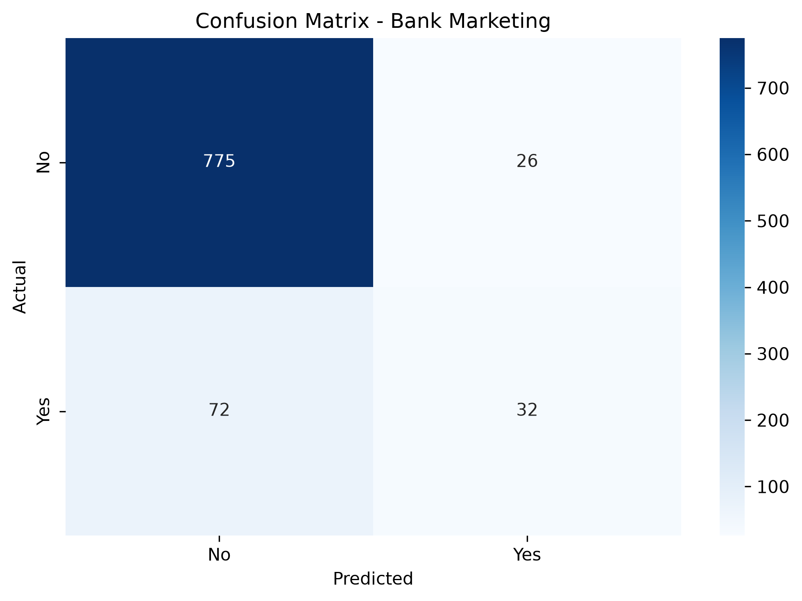

<<<<<<< HEAD
# SkillCraft Task 03 - Bank Marketing Decision Tree Classification

## Objective

Build a Decision Tree Classifier to predict whether a customer will subscribe to a bank term deposit based on demographic and behavioral information.

## Dataset

The project uses the Bank Marketing dataset from the UCI Machine Learning Repository.

- Dataset: Bank Marketing
- Records: 4,521
- Features: 16
- Problem Type: Binary Classification
- Target Variable: `y`
- Target Classes: `yes` / `no`

## Technologies Used

- Python
- Pandas
- NumPy
- Matplotlib
- Seaborn
- Scikit-learn

## Project Steps

1. Loaded the Bank Marketing dataset.
2. Explored the dataset structure and columns.
3. Checked data types and missing values.
4. Analyzed the target variable distribution.
5. Converted categorical variables into numerical features using one-hot encoding.
6. Split the dataset into training and testing sets.
7. Built a Decision Tree Classifier.
8. Evaluated the model using accuracy, confusion matrix, and classification report.
9. Visualized the decision tree and feature importance.
10. Created a confusion matrix heatmap.

## Data Preprocessing

Categorical variables were converted into numerical values using:

`pd.get_dummies()`

The target variable `y` was separated from the input features before model training.

The encoded dataset contained:

- 4,521 records
- 42 input features

The data was split into:

- Training set: 3,616 samples
- Testing set: 905 samples

## Model

A Decision Tree Classifier was trained using the processed Bank Marketing dataset.

The model was evaluated on the testing dataset using:

- Accuracy
- Precision
- Recall
- F1-score
- Confusion Matrix

## Results

The model achieved approximately **89% accuracy** on the test dataset.

The model performed significantly better at identifying customers who did not subscribe (`no`) than customers who subscribed (`yes`).

### Classification Performance

| Class | Precision | Recall | F1-Score |
|------|-----------|--------|----------|
| No | 0.91 | 0.97 | 0.94 |
| Yes | 0.55 | 0.31 | 0.40 |

The results indicate that the dataset is imbalanced, with considerably more `no` responses than `yes` responses.

## Visualizations

The project generates the following visualizations:

### Decision Tree

### Feature Importance

### Confusion Matrix

## Key Learnings

- Understanding and exploring a real-world classification dataset.
- Handling categorical variables using one-hot encoding.
- Splitting data into training and testing sets.
- Building a Decision Tree classification model.
- Evaluating classification models using multiple metrics.
- Understanding precision, recall, and F1-score.
- Interpreting feature importance.
- Visualizing model predictions using a confusion matrix.
- Understanding the effect of class imbalance on model performance.

## Conclusion

This task demonstrated the complete workflow of building a machine learning classification model, from data exploration and preprocessing to model training, evaluation, and visualization.

The Decision Tree achieved approximately 89% overall accuracy, while the evaluation also highlighted the challenge of predicting the minority `yes` class.
=======
# SCT_DS_Task03
>>>>>>> 592df4eb8fb41d07b341e9c9f3f4a50ef998dd16